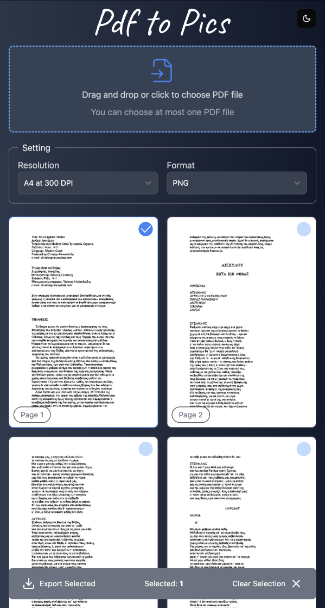
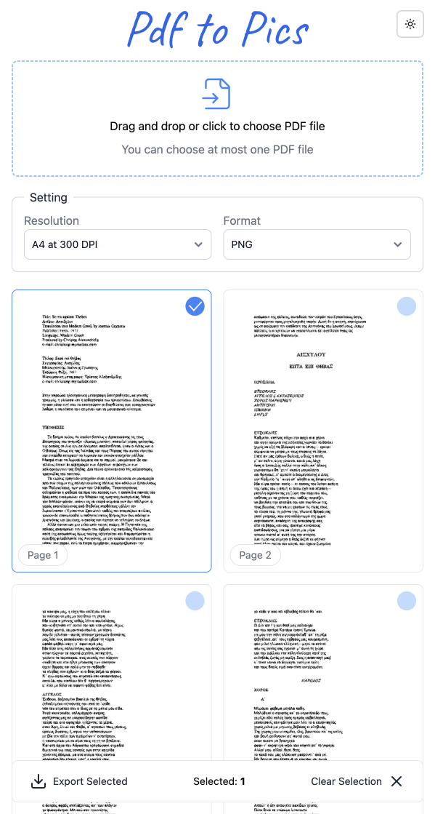

<div style="text-align: center">
   
   <h1>PDF to Pics</h1>
   <p>
      A progressive web application that converts PDF pages into high-quality images — built with Next.js and pdf.js.
      <br />
      👉 <a href="https://pdf2.pics" target="_blank">Check out the live version here!</a>
   </p>
</div>

## Features

- **Multithreaded Rendering**: Renders up to 4 pages simultaneously without blocking the main thread.
- **Offline-First**: Installable PWA, fully functional offline after the initial load.
- **Client-Side Processing**: Works entirely on the client side—no data is uploaded to a server.
- **Page Selection**: Convert one or multiple pages from a PDF document into high-quality images.
- **User-Friendly Interface**: Simple and clean UI for previewing and selecting PDF pages.

## Technologies Used

- **Next.js**: React-based framework for building web applications.
- **Tailwind CSS**: Utility-first CSS framework for rapid UI design.
- **pdf.js**: JavaScript library for rendering PDFs in web applications.
- **motion**: Library for animations and transitions.
- **zustand**: Lightweight state management library.
- **Web Workers & Service Workers**: For optimized performance and offline capabilities.

## Installation

To run the project locally, follow these steps:

1. **Cone the repo**:
    ```bash
    git clone https://github.com/smlntsv/pdf2pics.git
    ```
2. **Navigate to the project directory**:
    ```bash
    cd pdf2pics
    ```
3. **Install the dependencies**:
   > Use `--legacy-peer-deps` to ensure compatibility with React 19.
    ```bash
    npm install --legacy-peer-deps
    ```
4. **Start the development server**:
    ```bash
    npm run dev:https
    ```

Your app will be running on https://localhost:3000

## License

This project is licensed under the [MIT License](LICENSE).

## Screenshots

<div style="display: flex; justify-content: space-between;">
  
  
</div>
